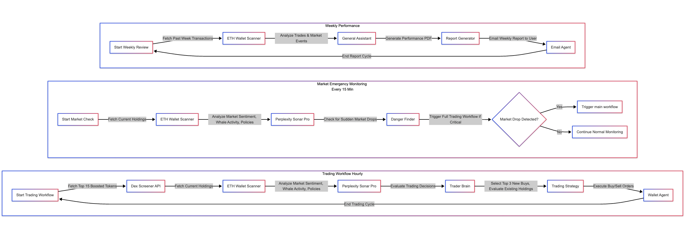

# Automated-AI-Powered-DeFi-Trading-System
A decentralized trading system where specialized AI agents analyze market signals—like whale activity, regulations, and sentiment—to deliver smart Buy/Sell/Hold recommendations via a central decision-making agent.

#  DeFi AI Trading System – OpenServ Hackathon Submission

## Overview

Crypto markets are highly volatile, making it difficult for traders to consistently react in time. Our AI-powered DeFi Trading System automates trading decisions by analyzing on-chain data, whale activity, market sentiment, and government policies. The result? An intelligent, hands-free trading experience designed for optimized portfolio management.

---

## Problem & Objective

Manual trading in crypto is time-consuming and emotionally driven. Traders often miss key signals or fall into patterns of FOMO/FUD.  
**Our objective** is to **automate and enhance trading** by using AI agents to process diverse market signals and respond faster than humanly possible, minimizing risk and maximizing returns.

---

## System Architecture & Methodology

Our system is built on **three interlinked workflows**, each performing specific tasks:

### 1.  Trading Workflow (Runs 3x Daily)
- Retrieves **Top 15 boosted tokens** from DEX Screener
- Scans user wallet holdings and current portfolio exposure.
- Uses **Perplexity Sonar Pro Agent** to analyze market conditions.
- **Trader Brain AI** selects:
  - Top 3 tokens to **Buy**
  - Existing holdings to **Sell**
- Trades are executed via the **Wallet Agent** using MetaMask.

### 2. Crash Detector (Runs every 15 minutes)
- Continuously monitors wallet portfolio.
- If a sharp drop in value is detected:
  - Immediately triggers the **Trading Workflow** to mitigate losses.

### 3. Weekly Performance Reporter
- Scans the wallet's **on-chain trade history**.
- Uses AI to analyze trade performance and trend patterns.
- Automatically generates a **PDF report** and sends it via **email**.

---

##  Features

-  **Fully Automated AI Trading**
-  **Real-Time Market Analysis**
-  **No Manual Monitoring** — Once funded, it runs autonomously
-  **On-chain Integration** with MetaMask
-  **Weekly Reports Delivered Straight to Inbox**

---

##  Tech Stack

-  **OpenAI Agents** (Prompt-engineered AI brains)
-  **DEX Screener API** – for market data
-  **Perplexity AI Sonar Pro** – for global crypto insights
-  **MetaMask API** – for wallet integration and trade execution
-  **Etherscan API** – for trade history
---

##  Contributors

- [Harsh Yadav]
- [Meena Ramachandran Kandimadai]

---

##  Conclusion

This system removes human bias, enables high-frequency decision-making, and ensures seamless, data-driven DeFi trading with zero manual effort. It’s not just a bot—it’s an AI trading assistant.

---

